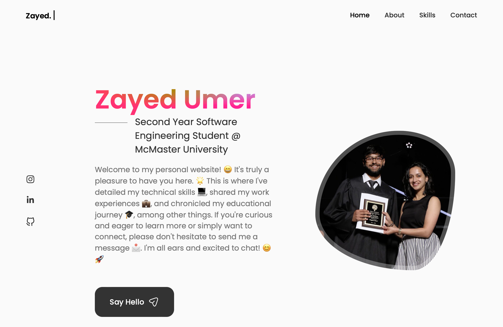

# My Personal Portfolio

## Overview

I'm a second-year software engineering student at McMaster University, and I'm passionate about creating innovative software solutions. This personal portfolio showcases my skills, projects, and experiences, serving as a digital resume for potential employers.

## Features

- **Aesthetic Design**: The portfolio is designed to be visually appealing and user-friendly, featuring a clean and modern interface.

- **Responsive**: It's built using HTML, CSS, and React, ensuring a responsive layout that works seamlessly on various devices and screen sizes.

- **Projects**: I've included a section highlighting some of my key projects, complete with descriptions and links to the code repositories and live demos.

- **About Me**: Learn more about me, my educational background, and my career aspirations in the "About Me" section.

- **Contact**: You can get in touch with me through the provided contact information and links to my social media profiles and GitHub.

## How to Access

You can view the portfolio by visiting [My Portfolio](https://zayedu.github.io).

## Technologies Used

- HTML
- CSS
- React

## Feedback and Contact

I'm always eager to improve and grow as a software engineer. Your feedback is valuable to me. Feel free to reach out to me through any of the contact methods provided in the portfolio, or you can open an issue on this GitHub repository.

## Looking to Collaborate?

I'm actively seeking a software engineering internship opportunity for the upcoming summer. If you're interested in working with a dedicated and aspiring software engineer, don't hesitate to get in touch.

Thank you for considering my portfolio, and I look forward to potentially working with you!

---

[Visit Portfolio](https://zayedu.github.io)
